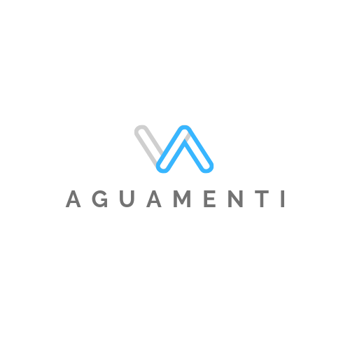
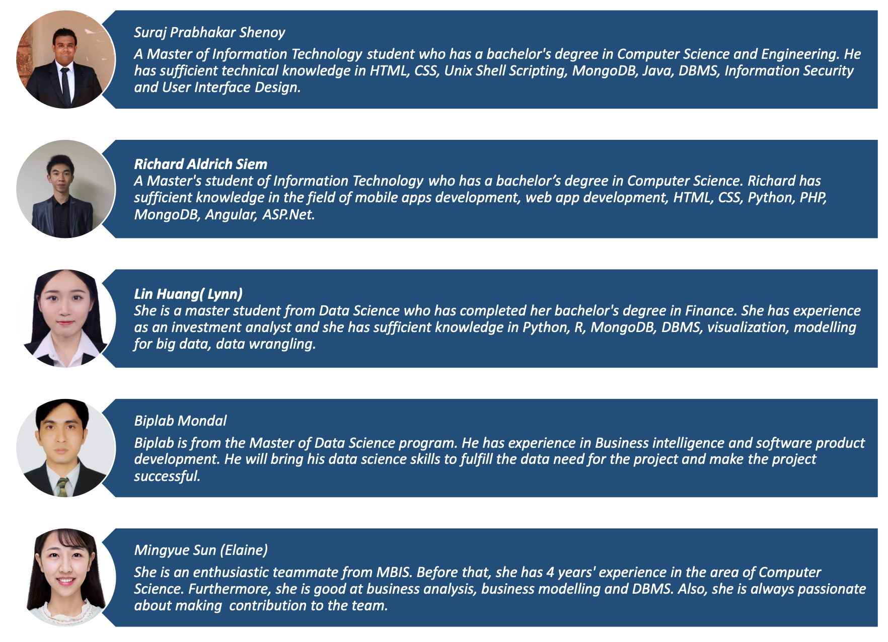

<!--
*** Template from https://github.com/othneildrew/Best-README-Template
*** Thank you Othneil Drew and other contributors for the time and effort to create a Read Me template.
-->

[![Contributors][contributors-shield]][contributors-url]
[![Forks][forks-shield]][forks-url]
[![Stargazers][stars-shield]][stars-url]
[![Issues][issues-shield]][issues-url]
<!--[![MIT License][license-shield]][license-url]
[![LinkedIn][linkedin-shield]][linkedin-url]-->

<!-- PROJECT LOGO -->
 

  

  <h3 align="center">Waterwegenvic</h3>

  

    An informative website for "our waterways need your help".
     
    <a href="https://github.com/rsiem/waterwegenvic"><strong>Explore the docs »</strong></a>
     
     
    <a href="https://github.com/rsiem/waterwegenvic/issues">Report Bug</a>
    ·
    <a href="https://github.com/rsiem/waterwegenvic/issues">Request Feature</a>
  

<!-- CONTACT -->
## Contact

Name | Email | Student ID
---- | ----- | ----------
Biplab Mondal | bmon0011@student.monash.edu | 30100046
Lin Huang (Lynn) | lhua0020@student.monash.edu | 28319370
Mingyue Sun (Elaine) | msun0015@student.monash.edu | 29204097
Richard Aldrich Siem | rsie0001@student.monash.edu | 25246860
Suraj Prabhakar Shenoy | sshe0020@student.monash.edu | 29391466

Project Link: [https://github.com/rsiem/waterwegenvic](https://github.com/rsiem/waterwegenvic)

<!-- MARKDOWN LINKS & IMAGES -->
<!-- https://www.markdownguide.org/basic-syntax/#reference-style-links -->
[contributors-shield]: https://img.shields.io/github/contributors/rsiem/waterwegenvic.svg?style=flat-square
[contributors-url]: https://github.com/rsiem/waterwegenvic/graphs/contributors
[forks-shield]: https://img.shields.io/github/forks/rsiem/waterwegenvic.svg?style=flat-square
[forks-url]: https://github.com/rsiem/waterwegenvic/network/members
[stars-shield]: https://img.shields.io/github/stars/rsiem/waterwegenvic.svg?style=flat-square
[stars-url]: https://github.com/rsiem/waterwegenvic/stargazers
[issues-shield]: https://img.shields.io/github/issues/rsiem/waterwegenvic.svg?style=flat-square
[issues-url]: https://github.com/rsiem/waterwegenvic/issues
<!--[license-shield]: https://img.shields.io/github/license/rsiem/repo.svg?style=flat-square
[license-url]: https://github.com/rsiem/repo/blob/master/LICENSE.txt
[linkedin-shield]: https://img.shields.io/badge/-LinkedIn-black.svg?style=flat-square&logo=linkedin&colorB=555
[linkedin-url]: https://linkedin.com/in/othneildrew-->
[product-screenshot]: images/screenshot.png
